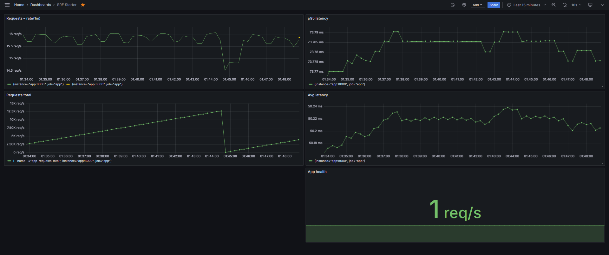
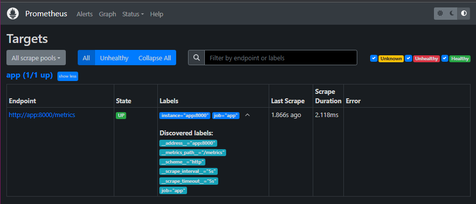
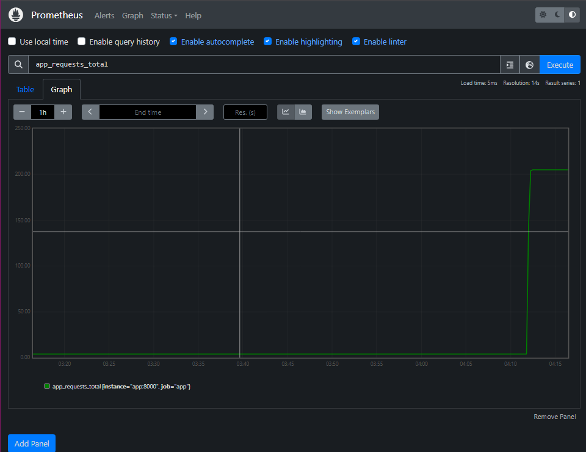
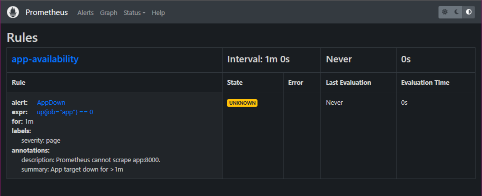
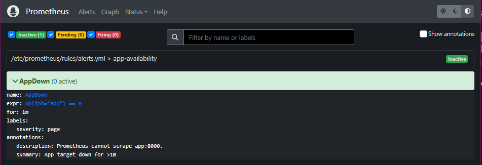

# SRE Starter: App + Prometheus + Grafana
Run: `docker compose up --build -d`
- App: http://localhost:8000  (`/healthz`, `/metrics`)
- Prometheus: http://localhost:9090
- Grafana: http://localhost:3000  (admin/admin first login)

Key panels: `rate(app_requests_total[1m])`,
`histogram_quantile(0.95, rate(app_request_latency_seconds_bucket[5m]))*1000 ms`,
`(rate(app_request_latency_seconds_sum[5m])/rate(..._count[5m]))*1000 ms`,
`up{job="app"}`.
Alert: AppDown (>1m) in `prometheus/rules/alerts.yml`.

### Screenshots

SRE Starter Grafana Dashboard

Prometheus Targets

Prometheus App Requests

Prometheus App Availability

Prometheus Alerts

